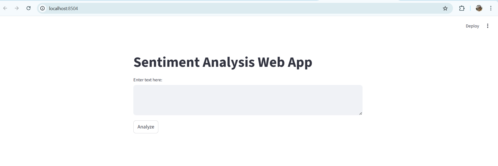
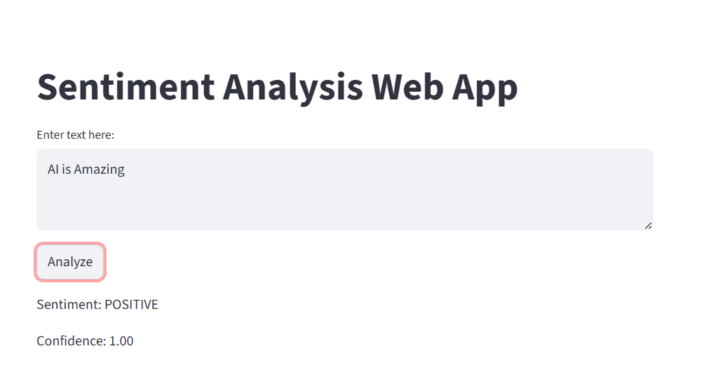

# Sentiment Analysis Web App 🎯

A simple **Streamlit application** that uses **Hugging Face Transformers** to analyze text sentiment (Positive/Negative).

---

## 🚀 Features
- User‑friendly Streamlit UI
- Hugging Face `pipeline` for sentiment analysis
- Real‑time prediction with confidence score

---

## 📸 Demo Screenshot


## ▶️ Running Example


---

## ⚙️ Installation
Clone the repository and install dependencies:
```bash
git clone https://github.com/ramishswati/sentiment-analysis-app.git
cd sentiment-analysis-app
pip install -r requirements.txt
